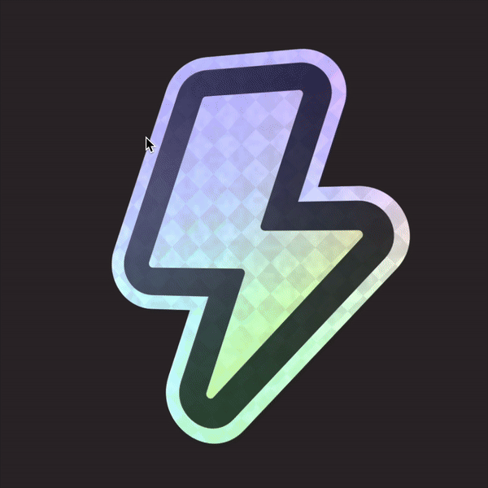

# Sticker

A Swift Package that uses Metal shaders to apply a Pokemon-style foil effect to a view.



# Installation

Add the following dependency to your `Package.swift` file:

```swift
dependencies: [
    .package(url: "https://github.com/bpisano/sticker", .upToNextMajor(from: "1.3.0"))
]
```

# Usage

Use the `.stickerEffect()` view modifier to apply the effect to any view.

```swift
import Sticker

struct ContentView: View {
    var body: some View {
        Image(.stickerIcon)
            .stickerEffect()
    }
}
```

By default, the effect is not animated.

## Parameters

The following modifiers are available to customize the sticker effect:

| Modifier                       | Default Value | Description                                                   |
| ------------------------------ | ------------- | ------------------------------------------------------------- |
| `.stickerScale(_:)`            | 3.0           | Controls the overall scale of the effect pattern              |
| `.stickerColorIntensity(_:)`   | 0.8           | Adjusts the strength of the holographic effect                |
| `.stickerContrast(_:)`         | 0.9           | Modifies the contrast between light and dark areas            |
| `.stickerBlend(_:)`            | 0.4           | Controls how much the effect blends with the original content |
| `.stickerCheckerScale(_:)`     | 5.0           | Adjusts the scale of the checker pattern                      |
| `.stickerCheckerIntensity(_:)` | 1.2           | Controls the intensity of the checker effect                  |
| `.stickerNoiseScale(_:)`       | 100.0         | Adjusts the scale of the noise pattern                        |
| `.stickerNoiseIntensity(_:)`   | 1.2           | Controls the intensity of the noise effect                    |
| `.stickerLightIntensity(_:)`   | 0.3           | Adjusts the intensity of the light reflection                 |

Example usage:

```swift
Image(.stickerIcon)
    .stickerEffect()
    .stickerColorIntensity(0.5)
    .stickerNoiseScale(200)
    .stickerLightIntensity(0.5)
```

## Motion

The effect can be animated using the `.stickerMotionEffect()` view modifier.

```swift
Image(.stickerIcon)
    .stickerEffect()
    .stickerMotionEffect(.pointerHover(intensity: 0.5))
```

Using the `.animation` view modifier allows you to control the animation of the effect.

```swift
Image(.stickerIcon)
    .animation(.snappy) { view in
        view
            .stickerEffect()
            .stickerMotionEffect(.pointerHover(intensity: 0.5))
    }
```

The following motion effects are available:

| Effect                                                  | Description                                                                                                                                                                                                                              |
| ------------------------------------------------------- | ---------------------------------------------------------------------------------------------------------------------------------------------------------------------------------------------------------------------------------------- |
| `.pointerHover(intensity:)`                             | Apply a 3D transform that looks at the pointer. The `intensity` parameter controls the strength of the effect.                                                                                                                           |
| `.dragGesture(intensity:)`                              | Apply a 3D transform that follows drag gestures. The `intensity` parameter controls the strength of the effect.                                                                                                                          |
| `.accelerometer(intensity:maxRotation:updateInterval:)` | Apply a 3D transform based on the device's accelerometer data. The `intensity` parameter controls the strength of the effect, while `maxRotation` defines the maximum rotation angle, applying a smooth rotation to the specified angle. |
| `.identity`                                             | Remove the motion effect.                                                                                                                                                                                                                |

You can create your own motion effects by implementing the `StickerMotionEffect` protocol.

```swift
struct MyMotionEffect: StickerMotionEffect {
    let startDate: Date = .init()

    func body(content: Content) -> some View {
        // Implement your motion effect here.
        // This example applies a sine wave rotation to the content.
        TimelineView(.animation) { context in
            let elapsedTime = context.date.timeIntervalSince(startDate)
            let rotation = sin(elapsedTime * 2) * 10
            content
                .rotationEffect(.degrees(rotation))
        }
    }
}

extension StickerMotionEffect where Self == MyMotionEffect {
    static var myMotionEffect: Self { .init() }
}
```

## Compiling Shaders

On iOS 18, macOS 15 and visionOS 2, Apple added the ability to compile Metal shaders at runtime to prevent frame delay on first use. You can compile the Sticker shaders as soon as your app launches by calling the following function:

```swift
import SwiftUI
import Sticker

@main
struct MyApp: App {
    var body: some Scene {
        WindowGroup {
            ContentView()
                .task {
                    await ShaderLibrary.compileStickerShaders()
                }
        }
    }
}
```
